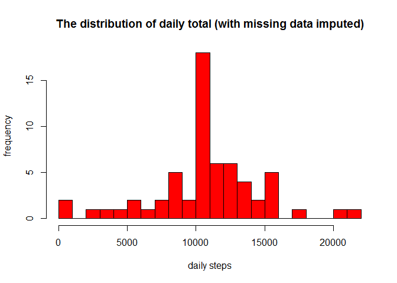

## Load activity monitoring data from the activity file


```r
cls = c("integer", "character", "integer")
df <- read.csv("activity.csv", head=TRUE, colClasses=cls, na.strings="NA")

df$date <- as.Date(df$date)
df_ign <- subset(df, !is.na(df$steps))
```

## Q1 - What is mean total number of steps taken per day?

### 1. Calculate the total number of steps taken per day. 


```r
dailysum <- tapply(df_ign$steps, df_ign$date, sum, na.rm=TRUE, simplify=T)
dailysum <- dailysum[!is.na(dailysum)]
```

### 2. Make a histogram of the total number of steps taken each day.


```r
hist(x=dailysum,
     col="red",
     breaks=20,
     xlab="Daily total steps",
     ylab="Frequency",
     main="The distribution of daily total (missing data ignored)")
```

<!-- -->

### 3. Calculate and report the mean and median of the total number of steps taken per day


```r
MeanPerDay <- mean(dailysum)
MedianPerDay <- median(dailysum)
```

The mean of the total nuber of steps per day is 1.0766189\times 10^{4}, while the median is 10765.

## Q2 - What is the average daily activity pattern?

### 1. Make a time series plot (i.e. type = "l" ) of the 5-minute interval (x-axis) and the average number of steps taken, averaged across all days (y-axis)


```r
int_avg <- tapply(df_ign$steps, df_ign$interval, mean, na.rm=TRUE, simplify=T)
df_ia <- data.frame(interval=as.integer(names(int_avg)), avg=int_avg)

with(df_ia,
     plot(interval,
          avg,
          type="l",
          xlab="5-minute intervals",
          ylab="average steps in the interval across all days"))
```

<!-- -->

### 2. Which 5-minute interval, on average across all the days in the dataset, contains the maximum number of steps?


```r
max_steps <- max(df_ia$avg)
df_ia[df_ia$avg == max_steps, ]
```

```
##     interval      avg
## 835      835 206.1698
```


## Q3 - Imputing missing values

### 1. Calculate and report the total number of missing values in the dataset (i.e. the total number of rows with NAs)


```r
NA.vals = sum(is.na(df$steps))
```

The number of missing values in the dataset is 2304.

### 2. Devise a strategy for filling in all of the missing values in the dataset.

If a 5-minute interval has missing value, I will use the mean for that 5-minute interval.

### 3. Create a new dataset that is equal to the original dataset but with the missing data filled in.


```r
df_impute <- df
ndx <- is.na(df_impute$steps)
int_avg <- tapply(df_ign$steps, df_ign$interval, mean, na.rm=TRUE, simplify=T)
df_impute$steps[ndx] <- int_avg[as.character(df_impute$interval[ndx])]
```

### 4. Make a histogram of the total number of steps taken each day and Calculate and report the mean and median total number of steps taken per day. Do these values differ from the estimates from the first part of the assignment? What is the impact of imputing missing data on the estimates of the total daily number of steps?


```r
new_dailysum <- tapply(df_impute$steps, df_impute$date, sum, na.rm=TRUE, simplify=T)

hist(x=new_dailysum,
     col="red",
     breaks=20,
     xlab="daily steps",
     ylab="frequency",
     main="The distribution of daily total (with missing data imputed)")
```

<!-- -->


```r
MeanPerDay.2 <- mean(new_dailysum)
MedianPerDay.2 <- median(new_dailysum)
```

The new mean is 1.0766189\times 10^{4} while the previous mean was 1.0766189\times 10^{4}.

The new median is 1.0766189\times 10^{4} while the previous median was 10765.

## Q4 - Are there differences in activity patterns between weekdays and weekends?

### 1. Create a new factor variable in the dataset with two levels – “weekday” and “weekend” indicating whether a given date is a weekday or weekend day.


```r
# helper function to decide if a day is a week day or not
is_weekday <- function(d) {
    wd <- weekdays(d)
    ifelse (wd == "Saturday" | wd == "Sunday", "weekend", "weekday")
}

wx <- sapply(df_impute$date, is_weekday)
df_impute$wk <- as.factor(wx)
```

### 2. Make a panel plot containing a time series plot (i.e. type = "l" ) of the 5-minute interval (x-axis) and the average number of steps taken, averaged across all weekday days or weekend days (y-axis). See the README file in the GitHub repository to see an example of what this plot should look like using simulated data.


```r
wk_df <- aggregate(steps ~ wk+interval, data=df_impute, FUN=mean)

library(lattice)
xyplot(steps ~ interval | factor(wk),
       layout = c(1, 2),
       xlab="Interval",
       ylab="Number of steps",
       type="l",
       lty=1,
       data=wk_df)
```

<!-- -->


